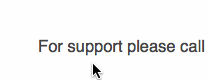

# Hint.Subtext.css 
*A tooltip library in CSS for your stupid websites*

`hint.css` is written as a pure CSS resource using which you can create cool tooltips for your web app. It does not rely on JavaScript but rather uses **data-* attribute**, **pseudo elements**, **content property** and **CSS3 transitions** to create the tooltips. Also it uses **BEM** naming convention particularly for the modifiers.

`hint.subtext.css` was written as a purely destructive expansion on hint.css, the example below gives a good indication of intended use. This stylesheet strips out all the great features of hint.css and leaves you with nothing but a hollow, snarky shell.



## Get Started

Include the library in the ``HEAD`` tag of your page:

```html
<link rel="stylesheet" href="hint.subtext.css"></link>
```

Now, all you need to do is find the misinformed parts of your website and correct them using the `data-subtext` attribute:


```html
Welcome to my <span data-subtext="terrible">awesome</span> website!
```

## License
Licensed under the [MIT license](http://opensource.org/licenses/MIT).

## Credits
You can head over to [hint.css](https://github.com/chinchang/hint.css) to see the original SASS goodness.
